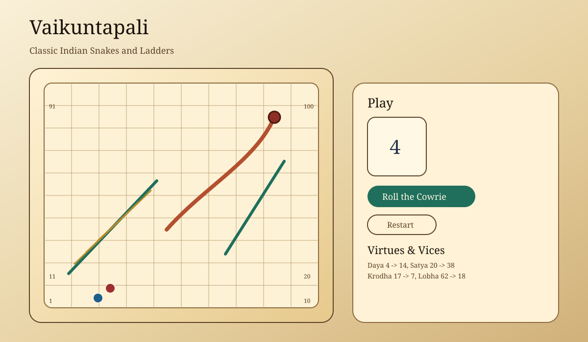

# User Guide: Vaikuntapali

## Overview
Vaikuntapali is a traditional Indian board game known worldwide as Snakes and Ladders. The board represents a moral journey: virtues lift you upward, vices bring you down. The goal is to reach Vaikuntha (square 100).

## Screenshot

## How To Play
1. Open `index.html` in a browser.
2. Player 1 starts. Click **Roll the Cowrie** to roll the die.
3. Your token moves forward by the roll amount.
4. If you land on a **stair (ladder)**, you climb up to the linked square.
5. If you land on a **serpent (snake)**, you slide down to the linked square.
6. You must roll the **exact number** to land on square 100.
7. The first player to reach 100 wins.

## Controls
- **Roll the Cowrie**: Roll the die and move the current player.
- **Restart**: Reset the game for a fresh start.

## Installation Variants
1. Open `index.html` directly from the filesystem.
2. Serve locally with Python: run `python3 -m http.server 8080` and open `http://localhost:8080`.
3. Serve locally with PHP: run `php -S localhost:8080` and open `http://localhost:8080`.
4. Serve locally with Node (if already installed): run `npx serve` and follow the printed URL.

## Board Guide
- Squares are numbered 1 to 100 in a winding path.
- **Virtues** are shown in green and act as ladders.
- **Vices** are shown in terracotta and act as snakes.
- Square 100 is labeled **Vaikuntha**.

## Tips
- Watch the activity log to see turn-by-turn actions.
- Plan for exact rolls near the end of the game.

## Troubleshooting
- If tokens look misplaced after resizing, refresh the page.
- If buttons do not respond, make sure your browser allows JavaScript.

## Customization Notes (For Hosts)
1. Edit `app.js` to change ladders, snakes, or the moral labels.
2. Tweak colors and typography in `styles.css` under `:root`.
3. To add more players, duplicate a token element in `index.html` and extend the `players` array in `app.js`.
